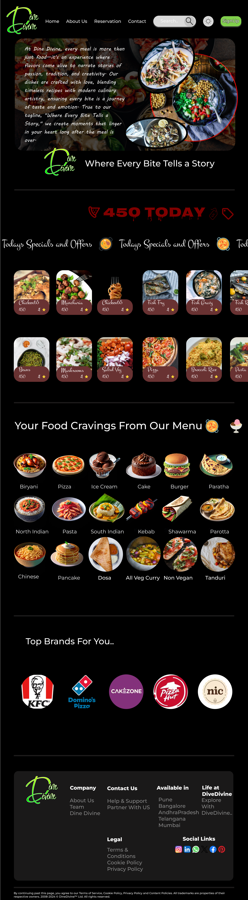
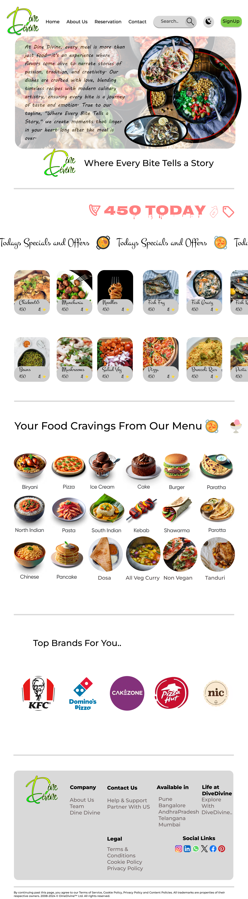

# DINE DIVINE - Restaurant Landing Page

## Overview
**DINE DIVINE** is a visually stunning **WebApp** designed in **Figma**, offering a top-tier **UI/UX** experience with full responsiveness. This landing page provides users with a seamless interface to explore restaurant menus, scroll through offers, and place food orders effortlessly. The application includes both **Dark Mode** and **Light Mode** to enhance user experience based on preference.

## Key Features
- **Dark Mode & Light Mode**: Switch between themes for a personalized experience.
- **Order Food Online**: Browse menus and place orders with ease.
- **Brand Selection**: Choose from popular brands like **KFC, CakeZone**, and more.
- **Special Offers & Discounts**: Get exclusive deals on various food items.
- **User Ratings & Reviews**: Order food based on customer ratings.
- **Responsive Design**: Optimized for all screen sizes, ensuring a smooth experience on mobile and desktop.

## Tech Stack
- **Design Tool**: Figma
- **UI/UX Principles**: Modern, accessible, and responsive design

## How to Access the Design
1. Open **Figma**.
2. Load the project file (if shared via link, open the provided link).
3. Navigate through different pages and frames to explore the complete UI design.

## Future Enhancements
- **Real-Time Order Tracking**.
- **AI-Based Food Recommendations**.
- **Loyalty Program & Rewards System**.
- **Integration with Payment Gateways**.
- **Personalized User Dashboard with Order History**.

## Author
Designed by **Joseph Korivi**.

## License
This project is licensed under the **MIT License** [LICENSE](LICENSE) – feel free to use and modify it as needed.

